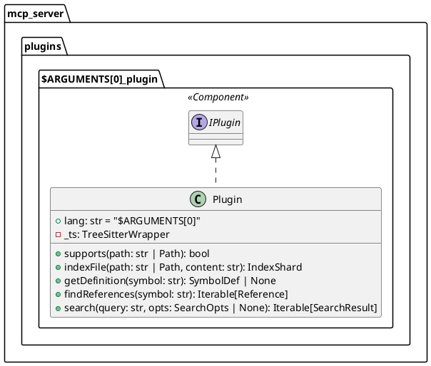

# add-feature

Add a new feature to Code-Index-MCP following the plugin-based architecture.

## Feature: $ARGUMENTS[0] (Type: $ARGUMENTS[1])

### 1. **Planning Phase**
- Define feature scope and requirements
- Determine if it's a new plugin, core feature, or utility
- Identify dependencies (Tree-sitter grammars, external libraries)
- Plan integration with existing components

### 2. **Architecture Design**

#### For New Language Plugin:
```
mcp_server/
├── plugins/
│   └── $ARGUMENTS[0]_plugin/
│       ├── __init__.py
│       ├── plugin.py           # Implements IPlugin interface
│       ├── AGENTS.md          # AI agent configuration
│       └── CLAUDE.md          # Plugin documentation
```

#### For Core Feature:
```
mcp_server/
├── $ARGUMENTS[0].py           # Core implementation
├── utils/
│   └── $ARGUMENTS[0]_helper.py # Supporting utilities
└── tests/
    └── test_$ARGUMENTS[0].py  # Unit tests
```

### 3. **Plugin Implementation Template**
```python
# mcp_server/plugins/$ARGUMENTS[0]_plugin/plugin.py
from pathlib import Path
from typing import Iterable

from ...plugin_base import (
    IPlugin, IndexShard, SymbolDef, 
    Reference, SearchResult, SearchOpts
)
from ...utils.treesitter_wrapper import TreeSitterWrapper

class Plugin(IPlugin):
    lang = "$ARGUMENTS[0]"
    
    def __init__(self) -> None:
        self._ts = TreeSitterWrapper()
        # Initialize language-specific components
    
    def supports(self, path: str | Path) -> bool:
        """Check if file extension matches plugin."""
        return Path(path).suffix in {".ext", ".extension"}
    
    def indexFile(self, path: str | Path, content: str) -> IndexShard:
        """Parse and index file content."""
        # Implementation using tree-sitter
        pass
    
    def getDefinition(self, symbol: str) -> SymbolDef | None:
        """Find symbol definition."""
        pass
    
    def findReferences(self, symbol: str) -> Iterable[Reference]:
        """Find all references to symbol."""
        pass
    
    def search(self, query: str, opts: SearchOpts | None = None) -> Iterable[SearchResult]:
        """Search for code patterns."""
        pass
```

### 4. **Integration with Dispatcher**
```python
# Update mcp_server/gateway.py or initialization code
from mcp_server.plugins.$ARGUMENTS[0]_plugin.plugin import Plugin as $ARGUMENTS[0]Plugin

# Add to plugin list
plugins = [
    PythonPlugin(),
    $ARGUMENTS[0]Plugin(),  # New plugin
    # ... other plugins
]
```

### 5. **Tree-sitter Grammar Setup**
```python
# If language needs tree-sitter support
# Update mcp_server/utils/treesitter_wrapper.py

# Add grammar installation
Language.build_library(
    'build/languages.so',
    [
        'vendor/tree-sitter-python',
        'vendor/tree-sitter-$ARGUMENTS[0]',  # New grammar
    ]
)
```

### 6. **Architecture Documentation**


### 7. **Update Architecture DSL**
```dsl
# Update architecture/level3_mcp_components.dsl
$ARGUMENTS[0]_plugin = container "$ARGUMENTS[0] Plugin" {
    $ARGUMENTS[0]_analyzer = component "$ARGUMENTS[0] Analyzer" {
        description "$ARGUMENTS[0] code analysis"
        technology "Python, Tree-sitter"
        tags "Plugin"
        properties {
            "interfaces" "I$ARGUMENTS[0]Plugin"
            "level4" "architecture/level4/$ARGUMENTS[0]_plugin.puml"
        }
    }
}
```

### 8. **Testing Implementation**
```python
# test_$ARGUMENTS[0]_plugin.py
import pytest
from mcp_server.plugins.$ARGUMENTS[0]_plugin.plugin import Plugin

def test_plugin_initialization():
    plugin = Plugin()
    assert plugin.lang == "$ARGUMENTS[0]"

def test_supports_correct_extensions():
    plugin = Plugin()
    assert plugin.supports("test.ext")
    assert not plugin.supports("test.py")

def test_index_file():
    plugin = Plugin()
    shard = plugin.indexFile("test.ext", "content")
    assert shard["language"] == "$ARGUMENTS[0]"
```

### 9. **Documentation Files**

#### AGENTS.md Template:
```markdown
# $ARGUMENTS[0] Plugin Agent Configuration

## Status: ⚠️ In Development

You are working with the $ARGUMENTS[0] plugin for the MCP code indexer.

## Capabilities
- Parse $ARGUMENTS[0] source files
- Extract symbols and definitions
- Find references across codebase
- Support semantic search

## Current Implementation
- [ ] Tree-sitter grammar integration
- [ ] Symbol extraction
- [ ] Reference tracking
- [ ] Search functionality

## Usage
The plugin automatically handles files with extensions: .ext, .extension
```

#### CLAUDE.md Template:
```markdown
# $ARGUMENTS[0] Plugin Documentation

The $ARGUMENTS[0] plugin provides code intelligence for $ARGUMENTS[0] language files.

## Features
- Syntax-aware parsing using Tree-sitter
- Symbol definition extraction
- Reference finding
- Code search

## Implementation Status
Currently in development. Basic structure implemented.

## Language Support
- File extensions: .ext, .extension
- Syntax elements: [list supported elements]
```

### 10. **Implementation Checklist**
- [ ] Create plugin directory structure
- [ ] Implement IPlugin interface
- [ ] Add tree-sitter grammar if needed
- [ ] Register plugin with dispatcher
- [ ] Create test file
- [ ] Add AGENTS.md configuration
- [ ] Add CLAUDE.md documentation
- [ ] Update architecture diagrams
- [ ] Update level3_mcp_components.dsl
- [ ] Test with sample files
- [ ] Update main documentation
- [ ] Add to plugin status in README.md

### 11. **Core Feature Alternative**

If implementing a core feature instead of a plugin:

```python
# mcp_server/$ARGUMENTS[0].py
class $ARGUMENTS[0]:
    """Core feature implementation."""
    
    def __init__(self, config: dict):
        self.config = config
    
    # Feature-specific methods
```

Update gateway or dispatcher to integrate:
```python
# mcp_server/gateway.py
from mcp_server.$ARGUMENTS[0] import $ARGUMENTS[0]

# Initialize and use feature
feature = $ARGUMENTS[0](config)
```

### 12. **Current Project Structure Reference**
```
/workspaces/Code-Index-MCP/
├── mcp_server/
│   ├── plugins/
│   │   ├── python_plugin/ (✅ implemented)
│   │   ├── c_plugin/ (❌ stub)
│   │   ├── cpp_plugin/ (❌ stub)
│   │   ├── js_plugin/ (❌ stub)
│   │   ├── dart_plugin/ (❌ stub)
│   │   └── html_css_plugin/ (❌ stub)
│   ├── utils/
│   │   ├── fuzzy_indexer.py
│   │   ├── semantic_indexer.py
│   │   └── treesitter_wrapper.py
│   ├── dispatcher.py
│   ├── gateway.py
│   ├── plugin_base.py
│   ├── sync.py (stub)
│   └── watcher.py (partial)
├── architecture/
│   ├── level4/ (PlantUML diagrams)
│   └── *.dsl (Structurizr files)
├── docs/
├── ai_docs/
└── tests/
```

### Notes:
- Only Python plugin is currently implemented
- File watcher exists but doesn't trigger indexing (TODO)
- About 20% of designed architecture is implemented
- Focus on completing existing stubs before adding new features