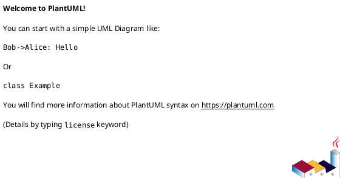

# PlantUML Reference for Code-Index-MCP

## Overview
This document serves as a comprehensive reference for using PlantUML to document the Level 4 (Code) architecture of Code-Index-MCP. It covers class diagrams with a focus on interfaces, packages, async methods, generics, and error handling.

## Basic Syntax

### Diagram Structure


### Comments
```plantuml
' Single line comment
/' Multi-line
   comment '/
```

## Interfaces

### Basic Interface Definition
```plantuml
interface IPlugin {
    +index(path: str): IndexResult
    +getDefinition(symbol: str): Definition
    +getReferences(symbol: str): List<Reference>
}
```

### Interface with Stereotypes
```plantuml
interface IAsyncIndexer <<async>> {
    +indexAsync(path: str): Task<IndexResult>
}

interface IComponentInterface <<Component Interface>> {
    ' Marks this as a component boundary interface
}
```

## Packages

### Package Definition
```plantuml
package "mcp_server.gateway" {
    interface IRequestHandler
    class GatewayController
}

package "mcp_server.plugins.python" #DDDDDD {
    interface IPythonPlugin
    class PythonPlugin
}
```

### Nested Packages
```plantuml
package "mcp_server" {
    package "core" {
        interface IDispatcher
    }
    package "plugins" {
        interface IPlugin
    }
}
```

## Classes

### Basic Class Definition
```plantuml
class DispatcherCore {
    -plugins: Dict<str, IPlugin>
    -cache: ICache
    +route(request: Request): Response
    +registerPlugin(name: str, plugin: IPlugin): void
}
```

### Abstract Classes
```plantuml
abstract class PluginBase {
    #config: Dict
    +{abstract} index(path: str): IndexResult
    +{abstract} getDefinition(symbol: str): Definition
    #validatePath(path: str): bool
}
```

## Methods and Properties

### Visibility Modifiers
- `+` public
- `-` private
- `#` protected
- `~` package-private

### Method Syntax
```plantuml
class Example {
    +publicMethod(): void
    -privateMethod(param: str): int
    #protectedMethod(): List<str>
    +staticMethod(): void {static}
    +abstractMethod(): void {abstract}
}
```

## Async Methods

### Using Stereotypes
```plantuml
interface IAsyncService {
    +<<async>> fetchData(id: str): Promise<Data>
    +<<async>> processRequest(req: Request): Task<Response>
    +syncMethod(): str
}

class AsyncImplementation {
    +<<async>> fetchData(id: str): Promise<Data>
    -<<async>> loadFromCache(key: str): Promise<Optional<Data>>
}
```

### Alternative Notation
```plantuml
interface IProcessor {
    +processAsync(data: Data): Awaitable<Result> <<async>>
    +process(data: Data): Result
}
```

## Generic Types

### Basic Generics
```plantuml
interface ICache<K, V> {
    +get(key: K): Optional<V>
    +set(key: K, value: V): void
    +getMany(keys: List<K>): Dict<K, V>
}

class LRUCache<K, V> {
    -cache: OrderedDict<K, V>
    -maxSize: int
    +get(key: K): Optional<V>
    +set(key: K, value: V): void
}
```

### Bounded Generics
```plantuml
interface IRepository<T extends Entity> {
    +find(id: str): Optional<T>
    +save(entity: T): void
    +findAll(): List<T>
}
```

## Error Handling

### Exception Declaration
```plantuml
interface IParser {
    +parse(content: str): AST {exceptions=ParseError,SyntaxError}
    +validate(ast: AST): bool {throws ValidationError}
}
```

### Using Stereotypes for Exceptions
```plantuml
class ParseError <<exception>> {
    +message: str
    +line: int
    +column: int
}

interface IIndexer {
    +index(path: str): IndexResult <<throws ParseError>>
}
```

### Dependency to Exception
```plantuml
interface IFileReader {
    +read(path: str): str
}

class FileNotFoundError <<exception>>
class PermissionError <<exception>>

IFileReader ..> FileNotFoundError : throws
IFileReader ..> PermissionError : throws
```

## Relationships

### Implementation
```plantuml
interface IPlugin
class PythonPlugin implements IPlugin
class JavaScriptPlugin implements IPlugin
```

### Inheritance
```plantuml
abstract class BasePlugin
class PythonPlugin extends BasePlugin
```

### Associations
```plantuml
' Simple association
ClassA -- ClassB

' Directed association
ClassA --> ClassB : uses

' Composition
ClassA *-- ClassB

' Aggregation
ClassA o-- ClassB

' Dependency
ClassA ..> ClassB : depends on
```

### Multiplicity
```plantuml
class Dispatcher {
    -plugins: List<IPlugin>
}
class Plugin

Dispatcher "1" --> "*" Plugin : manages
```

## Stereotypes and Tags

### Common Stereotypes
```plantuml
interface IService <<Service>>
class Controller <<Controller>>
class Repository <<Repository>>
class Factory <<Factory>>
interface IComponentInterface <<Component Interface>>
class Implementation <<Implementation>>
class InternalHelper <<Internal>>
```

### Custom Properties
```plantuml
class MetricsCollector {
    {field} -interval: int = 60
    {method} +collect(): Metrics
}
```

## Advanced Features

### Notes
```plantuml
interface ICache
note right of ICache
  This interface defines the contract
  for all cache implementations
end note

class RedisCache
note bottom : Implementation using Redis
```

### Constraints
```plantuml
interface IValidator {
    +validate(data: Any): bool
}

note right of IValidator::validate
  {constraint}
  Must return true for valid data
  Must not throw exceptions
end note
```

### Enums
```plantuml
enum IndexStatus {
    PENDING
    IN_PROGRESS
    COMPLETED
    FAILED
}

interface IIndexer {
    +getStatus(): IndexStatus
}
```

## Component Interface Pattern

### Defining Component Boundaries
```plantuml
package "Python Plugin Component" <<Component>> {
    ' Public interface (component boundary)
    interface IPythonPlugin <<Component Interface>> #LightGreen {
        +index(path: str): IndexResult
        +getDefinition(symbol: str): Definition
        +extract_graph_data(): GraphData
    }
    
    ' Implementation
    class PythonPlugin <<Implementation>> implements IPythonPlugin {
        -parser: IASTParser
        -analyzer: ISymbolAnalyzer
    }
    
    ' Internal interfaces
    interface IASTParser <<Internal>> #LightGray {
        +parse(content: str): AST
    }
    
    interface ISymbolAnalyzer <<Internal>> #LightGray {
        +analyze(ast: AST): List<Symbol>
    }
    
    ' Internal implementations
    class TreeSitterParser <<Internal>> implements IASTParser
    class JediAnalyzer <<Internal>> implements ISymbolAnalyzer
}
```

## Best Practices for Code-Index-MCP

### 1. Interface Naming
- Use `I` prefix for interfaces: `IPlugin`, `ICache`, `IDispatcher`
- Use descriptive names: `ISymbolResolver` not just `IResolver`

### 2. Component Interfaces
- Mark with `<<Component Interface>>` stereotype
- Use green color (#LightGreen) for visibility
- Place at package boundaries

### 3. Internal vs Public
- Mark internal classes with `<<Internal>>` stereotype
- Use gray color (#LightGray) for internal elements
- Only component interfaces should be referenced externally

### 4. Async Methods
- Consistently use `<<async>>` stereotype
- Include return type: `Promise<T>`, `Task<T>`, or `Awaitable<T>`

### 5. Error Handling
- Document exceptions in method signatures
- Create exception classes with `<<exception>>` stereotype
- Show throw relationships with dependency arrows

### 6. Package Organization
```plantuml
package "component_name" {
    ' 1. Component interfaces first
    interface IComponentInterface <<Component Interface>>
    
    ' 2. Other public interfaces
    interface IPublicHelper
    
    ' 3. Public implementations
    class MainImplementation implements IComponentInterface
    
    ' 4. Internal interfaces
    interface IInternalHelper <<Internal>>
    
    ' 5. Internal implementations
    class InternalImpl <<Internal>>
}
```

## Example: Complete Component Definition
```plantuml
@startuml
!define COMPONENT_INTERFACE <<Component Interface>>
!define INTERNAL <<Internal>>
!define ASYNC <<async>>

package "mcp_server.dispatcher" <<Component>> {
    ' Component boundary interface
    interface IDispatcher COMPONENT_INTERFACE #LightGreen {
        +route(request: Request): Response
        +ASYNC routeAsync(request: Request): Task<Response>
        +registerPlugin(name: str, plugin: IPlugin): void
    }
    
    ' Public implementation
    class DispatcherCore implements IDispatcher {
        -plugins: Dict<str, IPlugin>
        -router: IRouter
        -cache: ICache
        +route(request: Request): Response
        +ASYNC routeAsync(request: Request): Task<Response>
        +registerPlugin(name: str, plugin: IPlugin): void
    }
    
    ' Internal interfaces
    interface IRouter INTERNAL {
        +findPlugin(request: Request): Optional<IPlugin>
    }
    
    interface IRequestValidator INTERNAL {
        +validate(request: Request): bool {throws ValidationError}
    }
    
    ' Internal implementations
    class PluginRouter INTERNAL implements IRouter
    class RequestValidator INTERNAL implements IRequestValidator
    
    ' Relationships
    DispatcherCore --> IRouter : uses
    DispatcherCore --> IRequestValidator : uses
    
    ' External dependencies (from other components)
    DispatcherCore ..> IPlugin : routes to
    DispatcherCore ..> ICache : caches results
}

' Exception classes
class ValidationError <<exception>> {
    +message: str
    +field: str
}

IRequestValidator ..> ValidationError : throws
@enduml
```

## References
- [PlantUML Class Diagram Documentation](https://plantuml.com/class-diagram)
- [PlantUML Language Reference](https://plantuml.com/guide)
- [UML 2.5 Specification](https://www.omg.org/spec/UML/2.5/)