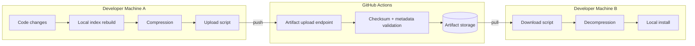

# Index Artifact Management Architecture

## Overview

The Index Artifact Management system provides efficient sharing of code indexes between developers while minimizing GitHub compute usage. It leverages GitHub Actions Artifacts for storage and implements a bidirectional sync mechanism.

## Design Principles

1. **Zero GitHub Compute**: All indexing happens on developer machines
2. **Cost-Effective Storage**: Uses free GitHub Actions Artifacts
3. **Simple Remote Sync**: Full artifact download when needed, local incremental reconciliation afterward
4. **Compatibility Checking**: Ensures indexes match local configuration
5. **Automatic Cleanup**: Old artifacts removed after retention period

## Architecture Components

### 1. Local Components

#### Index Builder
- Runs on developer machines
- Leverages local compute resources
- Updates indexes in real-time via file watcher
- Produces compressed artifacts

#### Artifact Manager
- `scripts/index-artifact-upload.py`: Compresses and prepares indexes
- `scripts/index-artifact-download.py`: Downloads and installs indexes
- Handles checksum verification and compatibility checking

#### CLI Interface
- `mcp_cli.py artifact push`: Upload local indexes
- `mcp_cli.py artifact pull`: Download indexes
- `mcp_cli.py artifact sync`: Check restored artifact drift against local branch/worktree
- `mcp_cli.py artifact list`: View available artifacts

### 2. GitHub Components

#### Actions Workflows
- `index-artifact-management.yml`: Core artifact management
- `index-management.yml`: Validation-only workflow (no rebuilding)
- Scheduled cleanup of old artifacts

#### Storage Strategy
- GitHub Actions Artifacts (500MB limit per artifact)
- Compression with tar.gz (level 9)
- Retention policies:
  - PR artifacts: 7 days
  - Main branch: 30 days
  - Promoted: Extended retention

### 3. Data Flow



## Implementation Details

### Compression Strategy

1. **Archive Format**: tar.gz with compression level 9
2. **Files Included**:
   - `code_index.db`: SQLite database
   - `vector_index.qdrant/`: Vector embeddings directory
   - `.index_metadata.json`: Compatibility information
   - `artifact-metadata.json`: Artifact-specific metadata

3. **Size Optimization**:
   - Typical compression ratio: 70%
   - 70MB index → ~20MB artifact
   - Excludes temporary files and logs

### Compatibility Management

1. **Metadata Tracking**:
   ```json
   {
     "embedding_model": "voyage-code-3",
     "model_dimension": 1024,
     "distance_metric": "cosine",
     "created_at": "2025-06-09T12:00:00Z",
     "commit": "abc123...",
     "index_stats": {
       "files": 429,
       "symbols": 31270
     }
   }
   ```

2. **Compatibility Checks**:
   - Embedding model version
   - Index schema version
   - File structure validation

### Cost Analysis

1. **Storage Costs**:
   - Public repositories: FREE
   - Private repositories: Included in plan quotas
   - Typical usage: 2-3GB/month

2. **Compute Savings**:
   - No GitHub Actions minutes used for indexing
   - Validation only: <1 minute per PR
   - Full rebuild avoided: Save 10-30 minutes per run

### Security Considerations

1. **Access Control**:
   - Artifacts inherit repository permissions
   - No separate authentication needed
   - GitHub token required for API access

2. **Data Integrity**:
   - SHA256 checksums for all archives
   - Verification before installation
   - Atomic replacement of indexes

## Usage Patterns

### Pattern 1: New Developer Onboarding
```bash
git clone <repository>
cd <repository>
mcp-index artifact pull --latest
mcp-index artifact sync
# Ready to develop immediately
```

### Pattern 2: Feature Development
```bash
# Pull a full artifact snapshot
mcp-index artifact pull --latest

# Reconcile local branch/worktree drift if needed
mcp-index artifact sync

# Make code changes
# Indexes update automatically via watcher/incremental indexing
git add .
git commit -m "feat: new feature"
mcp-index artifact push  # Share updated indexes
git push
```

### Pattern 3: CI/CD Integration
- PR: Validates provided indexes
- Merge: Promotes indexes to long-term storage
- No rebuilding in CI/CD pipeline

## Benefits

1. **Developer Experience**:
   - Instant setup for new developers
   - No waiting for index rebuilds
   - Seamless index sharing

2. **Resource Efficiency**:
   - Leverages developer hardware
   - Minimal GitHub Actions usage
   - Cost-effective storage

3. **Scalability**:
   - Works with any repository size
   - Keeps remote transport simple by using whole-artifact snapshots
   - Uses local incremental indexing to avoid most rebuild cost
   - Automatic cleanup prevents bloat

## Future Enhancements

1. **Local Branch Cache**: Cache a few recent branch-local reconciled snapshots if branch hopping becomes expensive
2. **P2P Sharing**: Direct developer-to-developer index sharing
3. **Cloud Cache**: CDN distribution for global teams
4. **Remote Delta Transport**: Revisit only if artifact size or pull frequency justifies the added complexity
