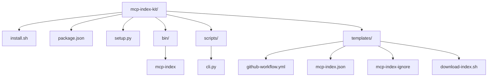
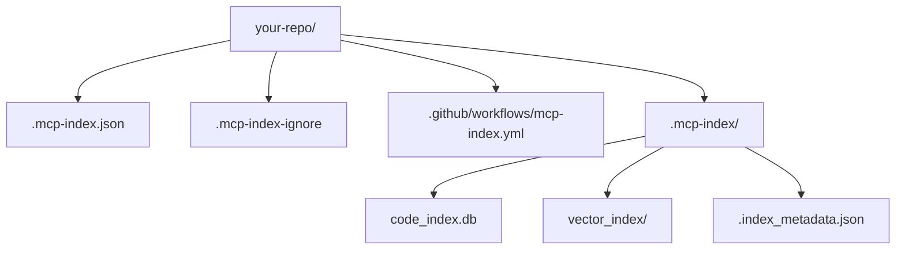
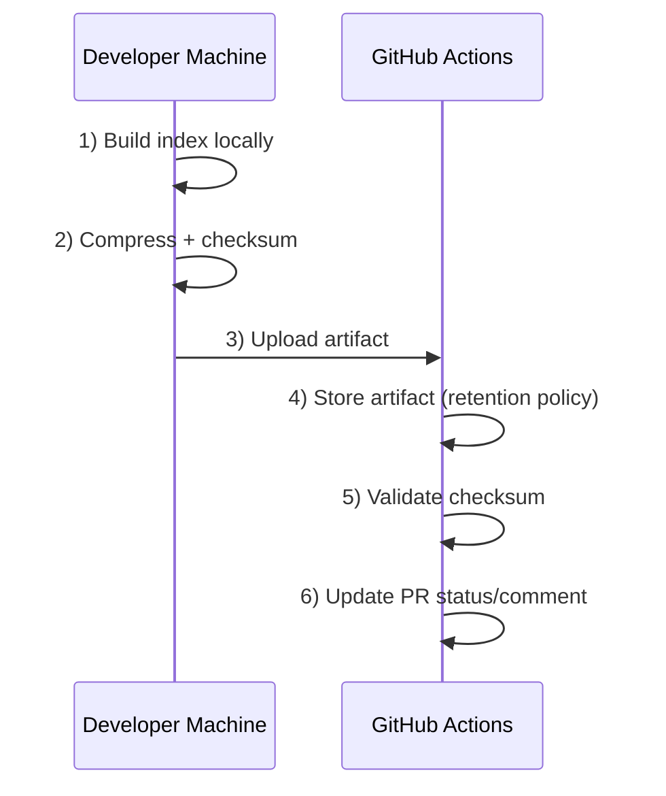
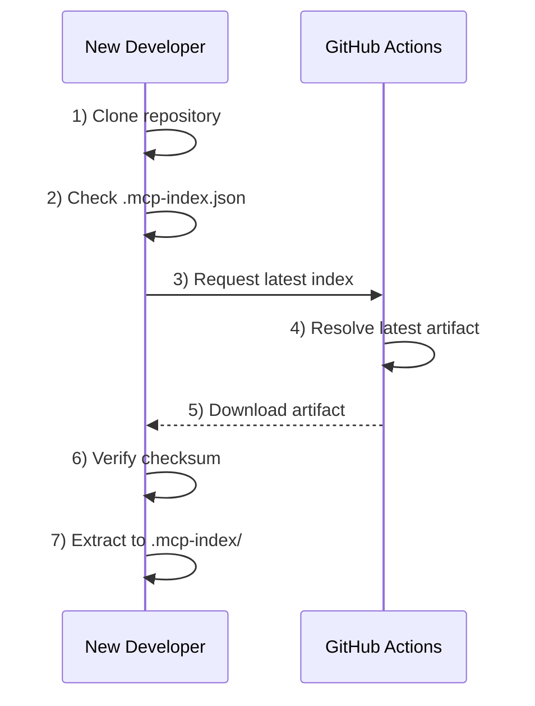
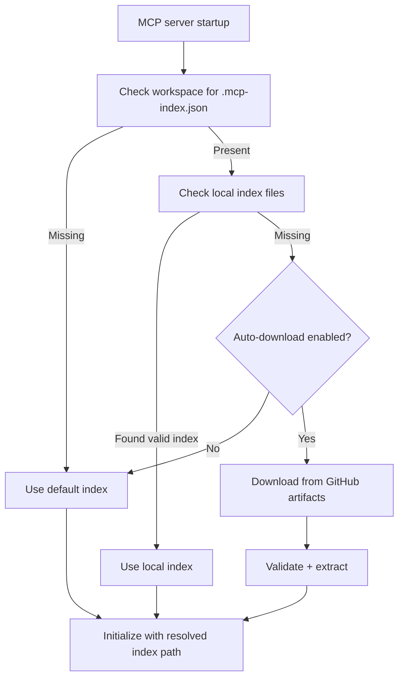

# Portable Index Management Architecture

## Overview

The portable index management system enables any repository to benefit from pre-built code indexes without computational overhead. It leverages GitHub Actions Artifacts for free storage and distribution.

## Architecture Goals

1. **Zero GitHub Compute**: All indexing happens on developer machines
2. **Universal Compatibility**: Works with any repository and language
3. **Cost Effective**: Uses free GitHub storage (public repos) 
4. **Automatic Sync**: Seamless pull on clone, push on change
5. **Optional**: Can be disabled per repository

## System Components

### 1. MCP Index Kit (`mcp-index-kit/`)

The portable toolkit that can be installed in any repository:



### 2. Index Discovery (`mcp_server/utils/index_discovery.py`)

Auto-detection mechanism for MCP servers:

```python
class IndexDiscovery:
    def is_index_enabled() -> bool
    def get_local_index_path() -> Optional[Path]
    def should_download_index() -> bool
    def download_latest_index() -> bool
    def get_index_info() -> Dict[str, Any]
```

### 3. Repository Structure

When initialized in a repository:



## Data Flow

### 1. Index Creation Flow



### 2. Index Download Flow



### 3. MCP Server Auto-Detection



## Configuration Schema

### `.mcp-index.json`

```json
{
  "version": "1.0",
  "enabled": true,
  "auto_download": true,
  "index_location": ".mcp-index/",
  "artifact_retention_days": 30,
  "ignore_file": ".mcp-index-ignore",
  "languages": "auto",
  "exclude_defaults": true,
  "custom_excludes": [],
  "github_artifacts": {
    "enabled": true,
    "compression": true,
    "max_size_mb": 100
  },
  "indexing_options": {
    "follow_symlinks": false,
    "max_file_size_mb": 10,
    "batch_size": 100,
    "parallel_workers": 4
  },
  "semantic_search": {
    "enabled": false,
    "provider": "voyage",
    "api_key_env": "VOYAGE_API_KEY"
  }
}
```

## Security Considerations

1. **Index Content**: Contains only code structure, not source code
2. **Artifact Visibility**: Follows repository visibility (public/private)
3. **Checksum Validation**: SHA256 verification of downloaded indexes
4. **API Keys**: Never stored in indexes, only in environment
5. **Access Control**: Uses GitHub permissions for artifact access

## Cost Analysis

### Public Repositories
- **Storage**: FREE (unlimited artifacts)
- **Bandwidth**: FREE (unlimited downloads)
- **Compute**: ZERO (local indexing only)
- **Retention**: 90 days default (configurable)

### Private Repositories
- **Storage**: Free up to 500MB per artifact
- **Bandwidth**: Counts against Actions minutes
- **Compute**: ZERO (local indexing only)
- **Retention**: 90 days default (configurable)

## Performance Characteristics

### Index Size Estimates
- Small project (<1K files): ~5-10 MB
- Medium project (10K files): ~50-100 MB
- Large project (100K files): ~200-500 MB

### Operation Times
- Index build: 1-5 minutes (local machine)
- Artifact upload: 10-60 seconds
- Artifact download: 5-30 seconds
- Index extraction: 2-10 seconds

## Extensibility Points

1. **Custom Indexers**: Pluggable indexing backends
2. **Storage Providers**: Beyond GitHub (S3, GCS, etc.)
3. **Index Formats**: Support for different index types
4. **Workflow Hooks**: Pre/post indexing scripts
5. **Language Configs**: Per-language indexing rules

## Implementation Status

✅ **Completed**:
- Universal installer script
- GitHub workflow templates
- CLI tool with full commands
- Index discovery mechanism
- MCP server integration
- Cost-effective architecture

## Future Enhancements

1. **Index Diffing**: Only upload changed portions
2. **P2P Sharing**: Direct developer-to-developer transfer
3. **Index Signing**: Cryptographic signatures for trust
4. **Cloud Providers**: S3, GCS, Azure Blob support
5. **Index Metrics**: Usage analytics and optimization
