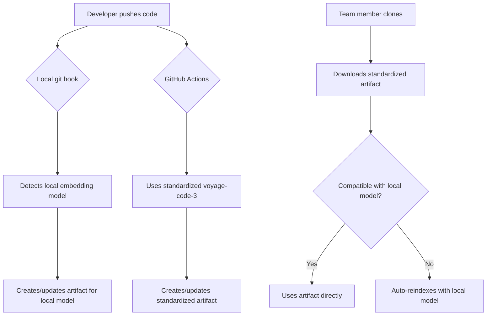

# Index Compatibility Guide

## Overview

The Code-Index-MCP system now includes comprehensive embedding model metadata and compatibility validation for index artifacts. This ensures that downloaded indexes are compatible with your local MCP configuration and prevents search quality issues.

## What's New in Version 2.0

### Enhanced Index Metadata

Index artifacts now include comprehensive embedding model information:

```json
{
  "version": "2.0",
  "timestamp": "2025-06-04T15:42:00.123456",
  "created_by": "MCP-Server v1.0.0",
  "embedding_model": {
    "model_name": "voyage-code-3",
    "provider": "voyage",
    "dimension": 1024,
    "model_version": "v1.0",
    "normalize": true,
    "batch_size": 100,
    "max_tokens": 16000,
    "compatibility_hash": "a1b2c3d4e5f6g7h8"
  },
  "index_stats": {
    "semantic_search_enabled": true,
    "include_embeddings": true,
    "indexing_mode": "full"
  }
}
```

### Smart Artifact Naming

Index artifacts are now named with model information:

```
code-index-voyage-code-3-1024d-v2.0-20250604_154200.tar.gz
```

Format: `code-index-{model}-{dimension}d-v{version}-{timestamp}.tar.gz`

## Compatibility Validation

### Automatic Validation

When importing an index, the system automatically checks:

- **Model Name**: Must match your local embedding model
- **Provider**: Must match your local embedding provider  
- **Dimension**: Vector dimensions must be identical
- **Configuration Hash**: Validates normalize settings and other config

### Seamless Auto-Reindexing (NEW)

If compatibility validation fails, the system can automatically reindex with your current settings:

```bash
# Default behavior - auto-reindex on incompatibility
python -m mcp_server index import-index incompatible-index.tar.gz
# ⚠️ Compatibility check failed: Model mismatch...
# 🔄 Auto-reindexing with current embedding model settings...
# ✅ Compatible index created at: ./target-dir
```

This eliminates manual intervention when sharing indexes across different embedding model configurations.

### Command Examples

**Import with validation (default):**
```bash
python -m mcp_server index import-index my-index.tar.gz
```

**Check compatibility without importing:**
```bash
python -m mcp_server index import-index my-index.tar.gz --dry-run
```

**Force import (skip validation):**
```bash
python -m mcp_server index import-index my-index.tar.gz --force
```

**Disable auto-reindexing:**
```bash
python -m mcp_server index import-index my-index.tar.gz --no-auto-reindex
```

**Specify source path for auto-reindexing:**
```bash
python -m mcp_server index import-index my-index.tar.gz --source-path ./my-project
```

**Verify existing index:**
```bash
python -m mcp_server index verify --path ./my-index --check-compatibility
```

## Export Enhanced Indexes

### Basic Export
```bash
python -m mcp_server index build --path ./my-project --output ./exports/my-index
```

### Export with Compression and Embeddings
```bash
python -m mcp_server index build \
  --path ./my-project \
  --output ./exports/my-index \
  --include-embeddings \
  --compress \
  --show-progress
```

This creates a compressed archive with model-aware naming:
```
code-index-voyage-code-3-1024d-v2.0-20250604_154200.tar.gz
```

## Smart Artifact Management

### Automatic Git Integration

The system now includes intelligent git hooks that automatically manage index artifacts:

#### Setup Git Hooks
```bash
# Enable smart artifact management
./scripts/setup-git-hooks.sh
```

#### How Smart Hooks Work

When you push to main/master branch, the git hook automatically:

1. **Detects your embedding model** (e.g., voyage-code-3, text-embedding-3-large)
2. **Checks remote for compatible artifacts** 
3. **Creates new artifacts** if none exist for your model
4. **Updates existing compatible artifacts** with latest changes
5. **Skips operations** when artifacts are already current

```bash
git push origin main
# [MCP-Index] Managing index artifacts for main branch push...
# [MCP-Index] Current embedding model: voyage-code-3 (voyage, 1024d)
# [MCP-Index] Found compatible artifact for current embedding model
# [MCP-Index] Index needs update (last indexed: abc123, current: def456)
# [MCP-Index] Building index artifact with current settings...
# [MCP-Index] ✓ Index artifact pushed to remote
```

### GitHub Actions Integration

For team consistency, GitHub Actions uses standardized embedding models:

#### Cloud Build Configuration
```yaml
# .github/workflows/mcp-index-cloud.yml
env:
  # Standardized for team consistency
  EMBEDDING_MODEL: "voyage-code-3"
  EMBEDDING_PROVIDER: "voyage" 
  EMBEDDING_DIMENSION: "1024"
```

#### Why Standardized Cloud Builds?

- ✅ **Team Consistency**: All team members get compatible artifacts
- ✅ **Reliable Performance**: Proven model with excellent code understanding  
- ✅ **Predictable Behavior**: No variation between developer setups

#### Local vs Cloud Workflow



## Compatibility Scenarios

### ✅ Compatible Indexes

**Scenario**: Both local and index use the same configuration
- Local: `voyage-code-3`, 1024d, Voyage provider
- Index: `voyage-code-3`, 1024d, Voyage provider
- **Result**: ✅ Import succeeds, optimal search quality

### ❌ Incompatible Indexes

**Scenario**: Different embedding models
- Local: `text-embedding-3-large`, 3072d, OpenAI provider
- Index: `voyage-code-3`, 1024d, Voyage provider
- **Result**: ❌ Import blocked with clear error message

**Error Output:**
```
✗ Compatibility check failed: Model mismatch: index uses 'voyage-code-3', local config uses 'text-embedding-3-large'
Use --force to import anyway (may cause issues)
```

### ⚠️ Legacy Indexes

**Scenario**: Importing older indexes without metadata
- **Result**: ⚠️ Warning shown, requires `--force` flag
- **Risk**: Unknown compatibility, search quality may vary

## Understanding Compatibility Hashes

The compatibility hash is generated from key configuration parameters:

```python
hash_components = [
    model_name,        # e.g., "voyage-code-3"
    dimension,         # e.g., "1024"
    provider,          # e.g., "voyage" 
    normalize          # e.g., "True"
]
```

This ensures that even subtle configuration differences are detected.

## Troubleshooting

### Issue: "Model mismatch" Error

**Problem**: Your local MCP uses a different embedding model than the index.

**Solutions**:
1. **Recommended**: Change your local configuration to match the index model
2. **Alternative**: Use `--force` to import (search quality may suffer)
3. **Best**: Re-export the index with your desired model

### Issue: "Dimension mismatch" Error

**Problem**: Vector dimensions don't match (e.g., 1024d vs 3072d).

**Solutions**:
1. **Required**: Use the same model/provider that created the index
2. **Not recommended**: Forcing import will likely cause search failures

### Issue: "Legacy format" Warning

**Problem**: Index created with older version of MCP.

**Solutions**:
1. Check if the index was created with a compatible model
2. Use `--force` if you're confident about compatibility
3. Re-export the original codebase with the new version

## Best Practices

### For Index Creators

1. **Document your model**: Include model info in sharing instructions
2. **Use compression**: Always use `--compress` for distribution
3. **Include embeddings**: Use `--include-embeddings` for portable indexes
4. **Version your exports**: Include timestamps in filenames

### For Index Consumers

1. **Always validate**: Let the compatibility check run (don't use `--force` unnecessarily)
2. **Use dry-run**: Test compatibility before importing large indexes
3. **Check local config**: Verify your embedding provider settings before importing
4. **Read metadata**: Use `verify --check-compatibility` to understand index requirements

## Configuration Examples

### Voyage AI Setup (Recommended)
```bash
export VOYAGE_API_KEY="your-key"
export EMBEDDING_MODEL="voyage-code-3"
export EMBEDDING_PROVIDER="voyage"
export EMBEDDING_DIMENSION=1024
```

### OpenAI Setup
```bash
export OPENAI_API_KEY="your-key"
export EMBEDDING_MODEL="text-embedding-3-large"
export EMBEDDING_PROVIDER="openai"
export EMBEDDING_DIMENSION=3072
```

### HuggingFace Setup
```bash
export HUGGINGFACE_API_TOKEN="your-token"
export EMBEDDING_MODEL="nvidia/NV-Embed-v2"
export EMBEDDING_PROVIDER="huggingface"
export EMBEDDING_DIMENSION=4096
```

## API Reference

### CLI Commands

**Build Index:**
```bash
python -m mcp_server index build [OPTIONS]
  --path TEXT                 Path to index [default: .]
  --output TEXT               Output directory [required]
  --include-embeddings        Include semantic embeddings
  --compress                  Compress the output
  --show-progress            Show progress bar
  --incremental              Only index changed files
  --quiet                    Suppress output
```

**Import Index:**
```bash
python -m mcp_server index import-index [OPTIONS] INDEX_PATH
  --target TEXT              Target directory to import to
  --show-progress           Show progress bar
  --force                   Skip compatibility validation
  --dry-run                 Validate compatibility without importing
  --auto-reindex            Automatically reindex if incompatible (default: true)
  --source-path TEXT        Source code path for auto-reindexing
```

**Verify Index:**
```bash
python -m mcp_server index verify [OPTIONS]
  --path TEXT               Index path to verify
  --check-compatibility     Check compatibility with local settings
```

### Metadata Schema

```typescript
interface IndexMetadata {
  version: string;                    // "2.0"
  timestamp: string;                  // ISO datetime
  created_by: string;                 // "MCP-Server v1.0.0"
  path: string;                       // Original indexed path
  
  embedding_model: {
    model_name: string;               // e.g., "voyage-code-3"
    provider: string;                 // e.g., "voyage"
    dimension: number;                // e.g., 1024
    model_version: string;            // e.g., "v1.0"
    normalize: boolean;               // e.g., true
    batch_size: number;               // e.g., 100
    max_tokens: number;               // e.g., 16000
    compatibility_hash: string;       // e.g., "a1b2c3d4e5f6g7h8"
  };
  
  index_stats: {
    semantic_search_enabled: boolean;
    include_embeddings: boolean;
    indexing_mode: "full" | "incremental";
  };
  
  settings: object;                   // Full settings snapshot
}
```

## Migration from Legacy Indexes

### Identifying Legacy Indexes

Legacy indexes (version 1.0) have these characteristics:
- No `embedding_model` section in metadata
- Missing compatibility hash
- No model information in filename

### Upgrading Legacy Indexes

1. **Check compatibility manually**:
   ```bash
   python -m mcp_server index verify --path ./legacy-index
   ```

2. **Import with force if compatible**:
   ```bash
   python -m mcp_server index import-index ./legacy-index --force
   ```

3. **Re-export to new format**:
   ```bash
   # After importing legacy index
   python -m mcp_server index build --path ./project --output ./new-index --compress
   ```

---

**Note**: Index compatibility validation is automatically enabled in version 2.0+. This prevents silent failures and ensures optimal search quality when sharing index artifacts.