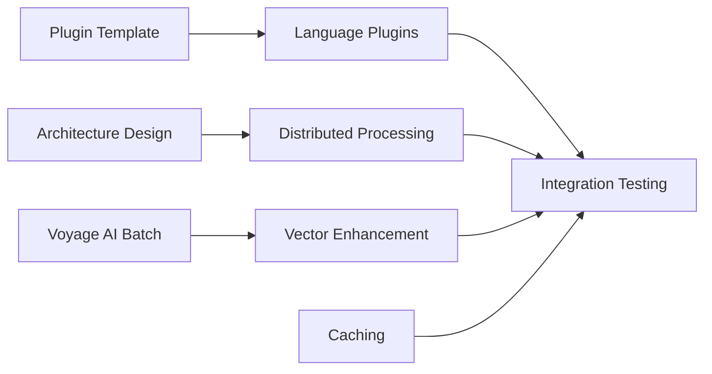

# Phase 5 Parallel Execution Plan

## Overview
This document outlines the parallel execution strategy for Phase 5, maximizing concurrent development across 4 independent tracks.

## Execution Timeline: 6-8 months (Q2-Q3 2025)

### Track 1: Language Plugins (3-4 developers)
**Can start immediately - No dependencies**

#### Week 1-2: Foundation
- [ ] Create plugin template and testing framework
- [ ] Set up language-specific development environments
- [ ] Download and integrate Tree-sitter grammars

#### Parallel Plugin Development (Week 3-14)
**Assign 1 developer per language:**

##### Developer 1: Rust Plugin (6 weeks)
```bash
# Week 3-4: Parser Integration
- [ ] Integrate tree-sitter-rust
- [ ] Basic symbol extraction (functions, structs, traits)
- [ ] Unit tests with small Rust files

# Week 5-6: Advanced Features
- [ ] rust-analyzer integration for type inference
- [ ] Cargo.toml dependency parsing
- [ ] Macro expansion support

# Week 7-8: Testing & Optimization
- [ ] Test on large Rust projects (rustc, tokio, actix)
- [ ] Performance optimization (<100ms target)
- [ ] Documentation and examples
```

##### Developer 2: Go Plugin (4 weeks)
```bash
# Week 3-4: Core Implementation
- [ ] Integrate tree-sitter-go
- [ ] Extract functions, interfaces, structs
- [ ] go.mod dependency parsing

# Week 5-6: Advanced Features & Testing
- [ ] gopls integration for enhanced analysis
- [ ] Goroutine and channel detection
- [ ] Test on major Go projects (kubernetes, docker)
```

##### Developer 3: JVM Plugin (6 weeks)
```bash
# Week 3-4: Java Support
- [ ] Integrate tree-sitter-java
- [ ] Eclipse JDT integration
- [ ] Maven/Gradle build file parsing

# Week 5-6: Kotlin Support
- [ ] Integrate tree-sitter-kotlin
- [ ] Unified JVM symbol handling
- [ ] Cross-language references

# Week 7-8: Testing & Integration
- [ ] Test on Spring Boot, Android projects
- [ ] Performance optimization
- [ ] Documentation
```

##### Developer 4: Ruby/PHP Plugins (4 weeks)
```bash
# Week 3-4: Ruby Plugin
- [ ] Integrate tree-sitter-ruby
- [ ] Rails framework detection
- [ ] Metaprogramming support

# Week 5-6: PHP Plugin
- [ ] Integrate tree-sitter-php
- [ ] Laravel framework detection
- [ ] Namespace and trait handling
```

### Track 2: Vector Search Enhancement (1-2 developers)
**Can start immediately - Builds on existing implementation**

#### Week 1-4: Voyage AI Optimization
```python
# Batch Processing Implementation
- [ ] Implement batch embedding API calls
- [ ] Add retry logic and error handling
- [ ] Optimize batch sizes for rate limits

# Flexible Dimensions
- [ ] Add dimension configuration (256, 512, 1024, 2048)
- [ ] Implement dimension-based index selection
- [ ] Benchmark accuracy vs performance

# Query/Document Types
- [ ] Implement input_type parameter usage
- [ ] A/B test search quality improvements
- [ ] Document best practices
```

#### Week 5-8: Qdrant Scaling
```python
# Production Deployment
- [ ] Design sharding strategy for 1M+ symbols
- [ ] Implement collection partitioning
- [ ] Set up replication for HA

# Performance Optimization
- [ ] Configure HNSW parameters
- [ ] Implement filtered search optimization
- [ ] Benchmark at scale (1M, 10M, 100M vectors)

# Multi-modal Support
- [ ] Integrate voyage-multimodal-3
- [ ] Support code + documentation embeddings
- [ ] Implement cross-modal search
```

### Track 3: Distributed Processing (2 developers)
**Can start after Week 2 - Needs architecture design**

#### Week 1-2: Architecture Design
```yaml
# System Design
- [ ] Design work queue schema
- [ ] Plan worker deployment strategy
- [ ] Define fault tolerance approach

# Technology Selection
- [ ] Evaluate Redis vs RabbitMQ
- [ ] Choose orchestration (Celery vs custom)
- [ ] Design monitoring strategy
```

#### Week 3-8: Implementation
```python
# Master Node (Developer 1)
- [ ] Implement work distribution algorithm
- [ ] Create job scheduling system
- [ ] Build progress tracking
- [ ] Implement result merging

# Worker Nodes (Developer 2)
- [ ] Create worker container/image
- [ ] Implement task processing
- [ ] Add health checks and recovery
- [ ] Build auto-scaling logic

# Integration Testing (Both)
- [ ] Test with 10+ workers
- [ ] Benchmark throughput
- [ ] Implement failure scenarios
- [ ] Load testing at scale
```

### Track 4: Caching & Performance (1 developer)
**Can start at Week 4 - Needs base implementation**

#### Week 4-6: Multi-tier Cache
```python
# Cache Implementation
- [ ] L1: In-memory LRU cache
- [ ] L2: Redis distributed cache
- [ ] L3: Disk-based cache for large results

# Intelligent Features
- [ ] Predictive cache warming
- [ ] Dependency-aware invalidation
- [ ] TTL optimization based on access patterns
```

#### Week 7-8: GPU Acceleration (Optional)
```python
# CUDA/Metal Support
- [ ] Implement GPU embedding acceleration
- [ ] Batch similarity computations
- [ ] CPU fallback for compatibility
- [ ] Benchmark performance gains
```

## Resource Allocation

### Development Team (6-8 engineers)
```
Track 1 - Language Plugins:     4 developers (parallel)
Track 2 - Vector Search:        2 developers 
Track 3 - Distributed:          2 developers
Track 4 - Caching/Performance:  1 developer (can be shared)
```

### Infrastructure Requirements
```yaml
Development:
  - 4x development machines with language SDKs
  - 1x GPU development machine (optional)
  - Voyage AI API access (development tier)
  - Qdrant cluster (development, 3 nodes)
  - Redis cluster (development, 3 nodes)

Testing:
  - CI/CD pipeline with parallel jobs
  - Test repositories for each language
  - Load testing infrastructure
  - Performance monitoring

Production:
  - Qdrant cluster (production, 5+ nodes)
  - Redis cluster (production, 5+ nodes)
  - Worker nodes (10+ for distributed)
  - GPU nodes (2-3 optional)
```

## Parallel Implementation Steps

### Month 1: Foundation (All Tracks)
```bash
# Week 1-2: Setup and Planning
parallel -j4 ::: \
  "setup_plugin_development_environment" \
  "design_distributed_architecture" \
  "configure_voyage_ai_access" \
  "setup_qdrant_development_cluster"

# Week 3-4: Initial Implementation
parallel -j4 ::: \
  "implement_rust_parser" \
  "implement_go_parser" \
  "implement_batch_embeddings" \
  "implement_work_queue"
```

### Month 2-3: Core Development (Parallel)
```bash
# All tracks work independently
Track 1: Complete language plugins
Track 2: Optimize vector search  
Track 3: Build distributed system
Track 4: Implement caching
```

### Month 4: Integration
```bash
# Week 13-14: Integration Testing
- [ ] Integrate all language plugins
- [ ] Test distributed indexing with new languages
- [ ] Benchmark end-to-end performance
- [ ] Fix integration issues

# Week 15-16: System Testing
- [ ] Load test with 1M+ files
- [ ] Test failover scenarios
- [ ] Optimize based on bottlenecks
- [ ] Prepare for deployment
```

## Critical Path Items

### Must Complete First (Blocking)
1. Plugin template and test framework (Week 1)
2. Distributed architecture design (Week 2)
3. Voyage AI batch API integration (Week 4)

### Can Be Parallelized
1. All language plugin development
2. Vector search optimization
3. Caching implementation
4. GPU acceleration

### Integration Dependencies


## Risk Mitigation

### Technical Risks
1. **Language Parser Complexity**
   - Mitigation: Start with simpler languages (Go) first
   - Fallback: Reduce feature scope if needed

2. **Distributed System Complexity**
   - Mitigation: Start with simple master-worker
   - Fallback: Use existing solutions (Celery)

3. **Performance Targets**
   - Mitigation: Early benchmarking and optimization
   - Fallback: Adjust targets based on reality

### Resource Risks
1. **Developer Availability**
   - Mitigation: Cross-train developers
   - Fallback: Prioritize core languages

2. **Infrastructure Costs**
   - Mitigation: Start with minimal clusters
   - Fallback: Delay GPU acceleration

## Success Metrics

### Weekly Checkpoints
- Language plugins: Lines of code parsed/second
- Vector search: Embeddings generated/minute  
- Distributed: Files processed/minute
- Cache: Hit rate percentage

### Monthly Milestones
- Month 1: All foundations complete
- Month 2: 50% feature complete
- Month 3: 100% feature complete
- Month 4: Integration complete

### Final Deliverables
- [ ] 5 new language plugins (Rust, Go, Java, Kotlin, Ruby, PHP)
- [ ] 10x performance improvement for large repos
- [ ] Distributed processing supporting 10+ workers
- [ ] 90% cache hit rate
- [ ] <100ms symbol lookup for all languages

## Next Immediate Actions

### Week 1 Sprint (All Parallel)
```bash
# Developer 1-4: Plugin Development
git checkout -b feature/phase5-language-plugins
mkdir -p mcp_server/plugins/{rust,go,jvm,ruby,php}_plugin
# Create plugin templates

# Developer 5-6: Vector Search
git checkout -b feature/phase5-vector-enhancement  
# Update semantic_indexer.py for batch processing

# Developer 7-8: Distributed Architecture
git checkout -b feature/phase5-distributed
mkdir -p mcp_server/distributed
# Create architecture design doc

# DevOps: Infrastructure
# Set up development clusters
# Configure CI/CD for parallel builds
```

### Communication Plan
- Daily standup for blockers
- Weekly cross-track sync
- Bi-weekly architecture review
- Monthly steering committee update

## Conclusion

By parallelizing development across 4 independent tracks, we can complete Phase 5 in 6-8 months with 6-8 developers. The key is maintaining independence between tracks until integration phase, allowing maximum concurrent progress.