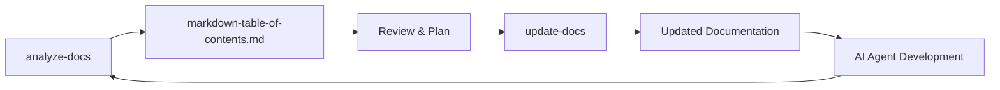

# Documentation Update Workflow Guide
# Location: /docs/guides/documentation-workflow.md

## Overview

This guide outlines the workflow for maintaining documentation using the analyze-docs and update-docs commands. These commands ensure your project documentation stays aligned with your codebase and optimized for AI agent development.

## Prerequisites

- Claude Code with custom commands installed in `.claude/commands/`
- Project with or without existing architecture
- Basic understanding of C4 architecture model (optional but helpful)

## Workflow Steps

### 1. Initial Analysis

Run the analysis command to understand current documentation state:

```bash
/project:analyze-docs
```

This will:
- Discover all markdown files
- Analyze architecture alignment
- Detect AI guidance inconsistencies
- Identify stale documentation
- Generate `markdown-table-of-contents.md`

### 2. Review Analysis Results

Open and review `markdown-table-of-contents.md`:

- Check **GOVERNANCE_MODE** (DOCUMENT_ONLY or CREATE_NEW)
- Review **ARCHITECTURAL_ALIGNMENT_STATUS**
- Note **CLAUDE_MD_MIGRATION_TASKS**
- Examine **AI_DOCS_STATUS** for stale content
- Review **AI_PLATFORM_GUIDANCE_SYNC** recommendations

### 3. Plan Updates

Based on analysis, decide what updates to execute:

**If GOVERNANCE_MODE: CREATE_NEW**
- Safe to create initial architecture
- Can generate ROADMAP.md template
- Will create starter documentation

**If GOVERNANCE_MODE: DOCUMENT_ONLY**
- Will not modify existing architecture
- Only documents divergences
- Updates documentation to match reality

### 4. Execute Updates

Run the update command:

```bash
/project:update-docs
```

This will:
1. Create alignment plan (`ALIGNMENT_PLAN_[date].md`)
2. Migrate CLAUDE.md custom content to AGENTS.md
3. Enhance ROADMAP.md with Next Steps
4. Document architecture divergences
5. Update stale AI documentation
6. Consolidate AI platform guidance
7. Generate validation report

### 5. Verify Updates

Check the generated report:
- `DOCUMENTATION_UPDATE_REPORT_[date].md`
- Verify all planned updates completed
- Review any warnings or errors
- Check for manual review items

### 6. AI Agent Development

With updated documentation, AI agents can:
- Follow Next Steps in ROADMAP.md
- Reference architecture alignment
- Use consolidated guidance
- Access current AI documentation

## Command Interactions



## Best Practices

### Run Regularly
- Start each development iteration with analysis
- Update documentation before major changes
- Keep AI guidance synchronized

### Preserve Backups
- Commands create `.backup/` directory
- Contains pre-update versions
- Useful for rollbacks if needed

### Review Before Committing
- Check git diff after updates
- Ensure changes align with expectations
- Commit with clear message

### Document Divergences
- Don't hide architecture mismatches
- Document them for review
- Let architects make decisions

## Troubleshooting

### Common Issues

**"No architecture found"**
- Expected for new projects
- CREATE_NEW mode will help
- Safe to generate templates

**"Multiple CLAUDE.md files with custom content"**
- Normal for projects with history
- Update command will migrate
- Review consolidated AGENTS.md

**"Stale AI documentation detected"**
- Documentation >30 days old
- Update command refreshes via web search
- Verify web search tool available

### Manual Interventions

Some situations require human decision:
- Architecture divergences
- Technology conflicts
- Missing components in plans

These are documented but not auto-resolved.

## Integration with AI Platforms

### Claude Code
- Uses CLAUDE.md as memory file
- @imports for references
- AGENTS.md for guidance

### Codex
- Primary guidance in AGENTS.md
- Directory-specific context
- Nested file support

### Cursor
- Rules in `.cursor/rules/*.mdc`
- Auto-attachment by path
- Platform-specific format

## Continuous Improvement

The workflow supports iterative improvement:

1. **Analyze** current state
2. **Update** documentation
3. **Develop** with AI agents
4. **Discover** new patterns
5. **Document** learnings
6. **Repeat** cycle

This creates a positive feedback loop where documentation quality improves with each iteration.
