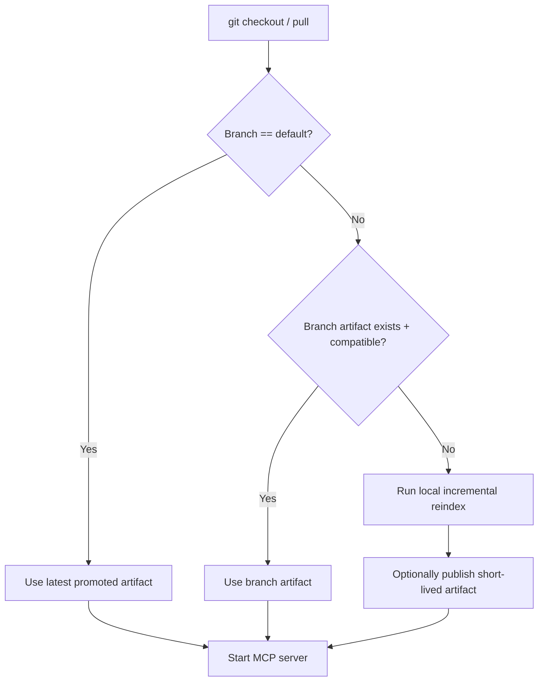
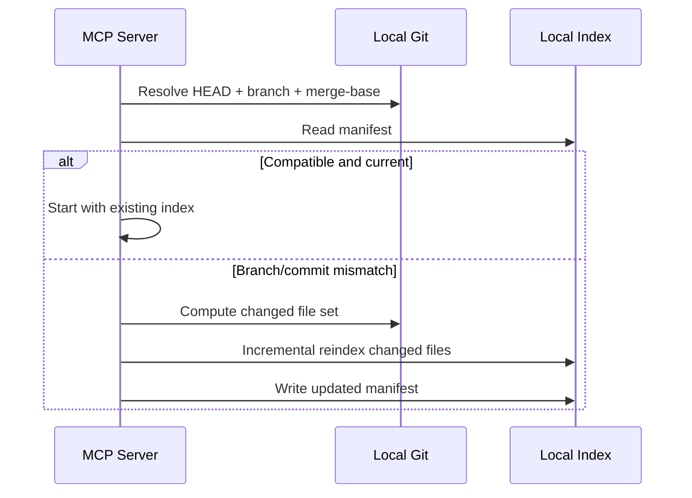

# Productionization Plan (2026-02)

## Executive Summary

This plan finalizes Code-Index-MCP for reliable production use with focus on:

1. predictable index correctness,
2. resilient Git-aware storage lifecycle,
3. operational observability,
4. documentation quality and consistency.

## Architecture Decision: GitHub Artifact-backed Indexes

Adopt a **tiered index policy**:

- **Tier 1 (default branch only)**: Always publish and retain the newest successful index for the repository default branch.
- **Tier 2 (ephemeral branch indexes)**: Branch/PR indexes are optional and short-lived.
- **Tier 3 (on-demand historical rebuild)**: Older commits/tags are indexed lazily when checked out locally.

## Canonical Index Identity

Index identity should be computed from immutable dimensions:

- repository slug,
- commit SHA,
- schema version,
- embedding model + dimension,
- parser/plugin set hash.

Suggested artifact naming format:

`mcp-index-{repo_hash}-{branch}-{short_sha}-{schema}-{embed_hash}`

## Resilience to Git Changes

### Rules

1. On startup, compare `HEAD` with index manifest commit.
2. If same commit: use index immediately.
3. If ancestor/descendant relation detected: run incremental repair.
4. If divergent history: reindex changed paths using `git diff --name-only merge-base..HEAD`.
5. If branch switch detected and no compatible index: fallback to local rebuild, then optional artifact publish.

## Operational Hardening Backlog

### Priority 0 (blocking)

- Enforce artifact integrity checks (checksum + manifest validation) for every pull.
- Add safe archive extraction guardrails (no path traversal).
- Add startup health gate to reject incompatible schema/model combinations.

### Priority 1

- Add artifact retention policy automation:
  - keep latest successful default-branch artifact,
  - keep last N promoted releases,
  - expire branch artifacts quickly.
- Add disaster recovery command:
  - `mcp_cli.py artifact recover --branch <name> --commit <sha>`.

### Priority 2

- Add delta export/import to reduce artifact size and transfer time.
- Add remote cache abstraction (S3/GCS/Azure) behind storage interface.

## Documentation Quality Policy

1. New diagrams must use Mermaid blocks.
2. Legacy ASCII diagrams should be converted or removed.
3. Add CI doc check to fail on box-drawing ASCII diagram patterns.

## Rollout Plan

1. **Week 1**: Ship manifest compatibility gates and artifact selection policy.
2. **Week 2**: Ship default-branch promotion workflow + retention automation.
3. **Week 3**: Ship incremental Git-aware reindex and branch switch logic.
4. **Week 4**: Publish SLOs (startup latency, index freshness, search latency) and run canary rollout.

## Success Metrics

- P95 startup-to-ready < 15s with artifact pull path.
- Index compatibility failures < 1% of startups.
- Branch switch recovery < 60s for medium repo.
- Search correctness parity maintained across branch transitions.
