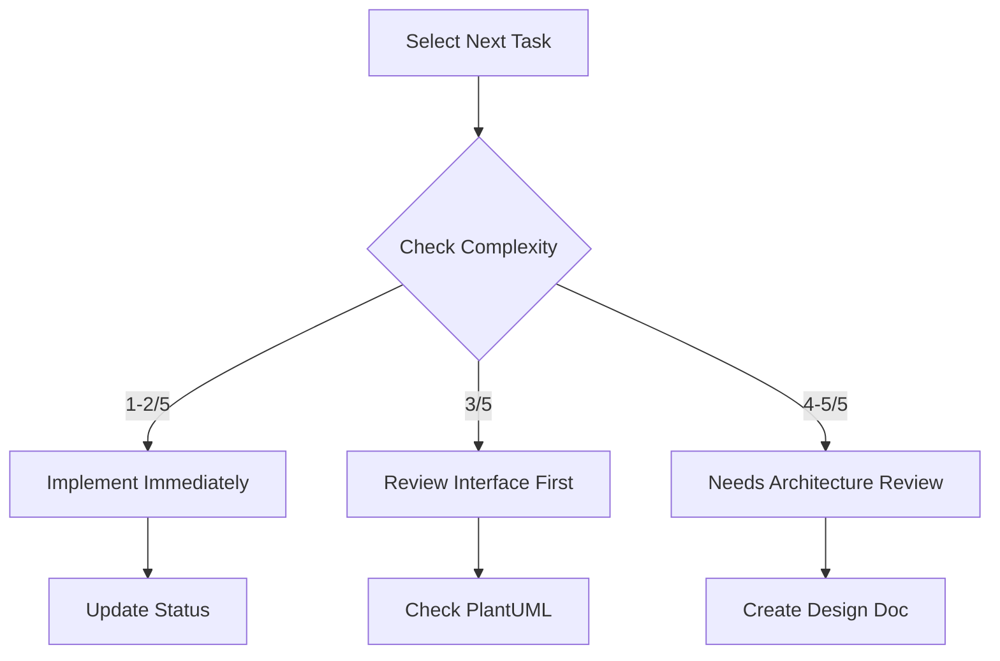

# ROADMAP.md Next Steps Section Template
# Location: /docs/templates/roadmap-next-steps-template.md

This template provides the structure for creating comprehensive Next Steps sections in ROADMAP.md files optimized for AI agent development.

## Template Structure

```markdown
## Next Steps

### Implementation Strategy: Interface-First Development

Following C4 architecture model from outside-in approach to minimize integration issues.

#### Phase 1: Container Interfaces [Complexity: X/5] ⏱️ X days
**Parallel Execution Streams:**

**Stream A - [Interface Type]:**
- [ ] Define contracts in `architecture/[location]`
  - Complexity: X/5
  - Dependencies: [List any]
  - AI Docs: `@/ai_docs/[framework].md`
  
**Stream B - [Interface Type]:**
- [ ] Create interfaces in `architecture/code/[name].puml`
  - Complexity: X/5
  - Pattern: [Pattern name]
  - Example: See `architecture/examples/[template].puml`

#### Phase 2: Module Boundaries [Complexity: X/5] ⏱️ X days

**[Module Name]** (`src/[path]/`)
- [ ] Interface definition: `src/[module]/interfaces.[ext]`
- [ ] PlantUML diagram: `architecture/code/[module]-module.puml`
- [ ] Integration tests: `tests/integration/[module]/`
- Complexity: X/5
- AI Docs: `@/ai_docs/[relevant].md`

#### Phase 3: Internal Integration [Complexity: X/5] ⏱️ X days

**[Integration Component]:**
- [ ] Core interface: `src/core/[component]/[name].[ext]`
- [ ] Implementation: `src/core/[component]/[impl].[ext]`
- Tests: Unit tests for each implementation
- Pattern: [Pattern name]
- AI Docs: `@/ai_docs/[pattern].md`

### AI Agent Task Selection Guide



### Progress Tracking

After completing each task:
1. Check the box in this file
2. Update `architecture/implementation-status.md` with percentage
3. If you found issues, add to `architecture/divergences.md`
4. Run tests: `[test command]`
5. Update relevant PlantUML if design changed

### Architecture Sync Points

Before implementing:
1. Check `architecture/workspace.dsl` for component definition
2. Verify PlantUML exists in `architecture/code/`
3. Ensure interfaces are defined
4. Confirm no divergences in `architecture/divergences.md`
```

## Key Elements to Include

1. **Complexity Ratings**: Rate each task 1-5
2. **Time Estimates**: Realistic timeframes
3. **Parallel Streams**: Enable concurrent work
4. **File Mappings**: Exact paths for deliverables
5. **AI Doc References**: Framework documentation links
6. **Visual Guides**: Diagrams for decision flow
7. **Progress Tracking**: Clear update instructions
8. **Architecture Sync**: Alignment checkpoints

## Customization Guide

### For Your Project:
1. Replace `[placeholders]` with actual values
2. Add project-specific phases
3. Include your test commands
4. Reference your architecture files
5. Add your AI documentation

### Complexity Rating Guide:
- **1/5**: Simple, well-defined tasks
- **2/5**: Standard implementations
- **3/5**: Integration work
- **4/5**: Complex design decisions
- **5/5**: Architecture-level changes

## Example Usage

```bash
# After running analyze-docs, check if Next Steps exists
if ! grep -q "## Next Steps" ROADMAP.md; then
    # Append this template structure
    # Customize with your project specifics
fi
```
