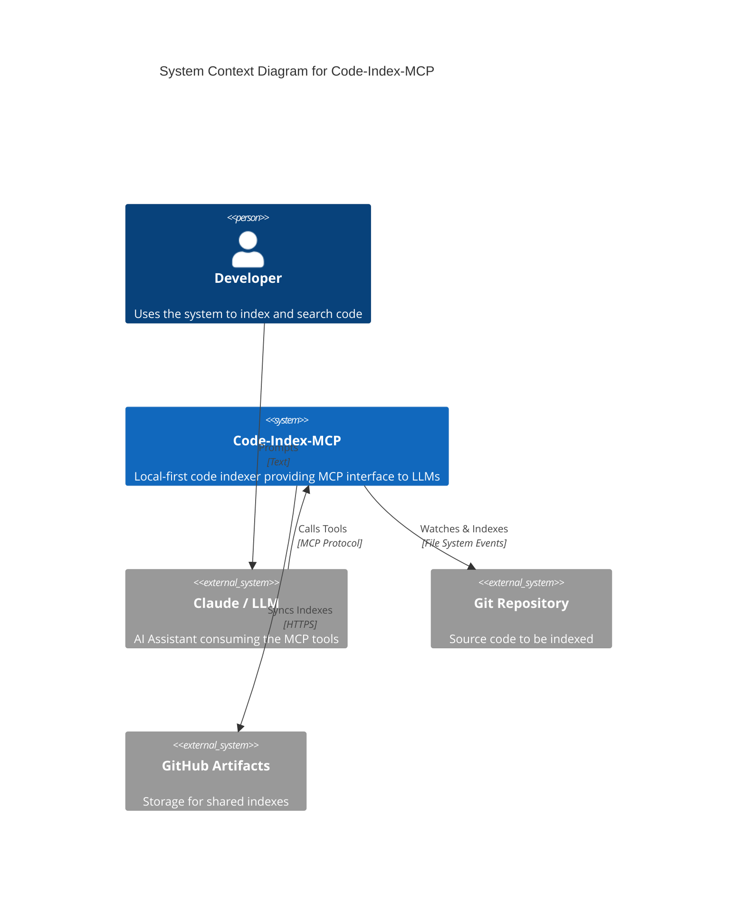
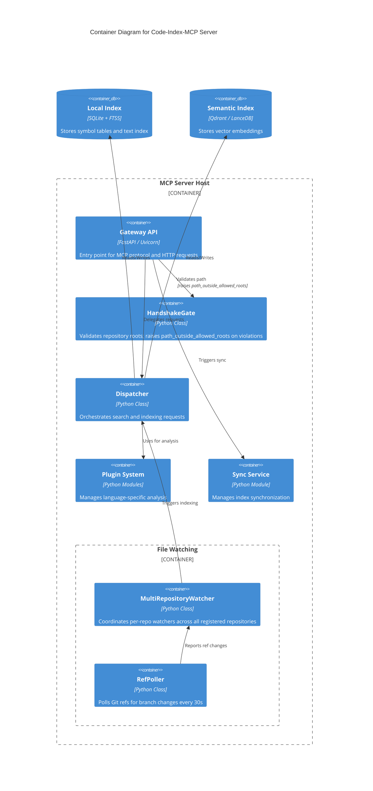
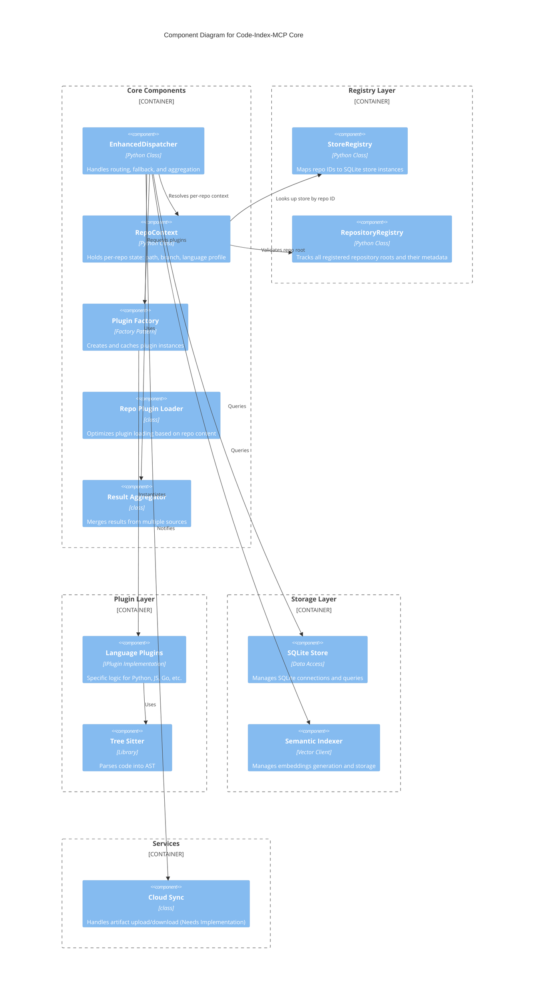

# System Architecture

## Level 1: System Context

## Level 2: Container Diagram

## Level 3: Component Diagram (MCP Server)

## Dependability Notes

`EnhancedDispatcher.lookup()` falls through to `plugin.getDefinition()` for every registered language plugin when a symbol is absent from the SQLite index. The C plugin can hang in tree-sitter traversal on this fallback path. Surfaced during the multi-repo integration test in P5/SL-3. Not fixed; callers should expect occasional slow lookups on C-file symbols.
