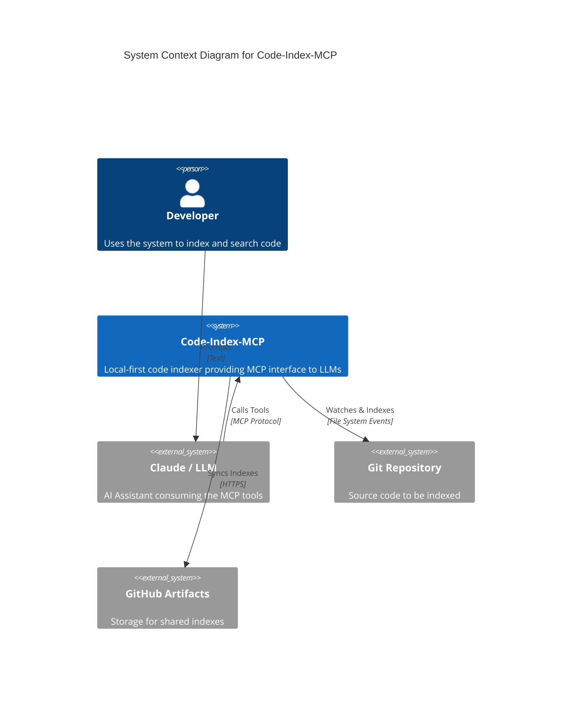
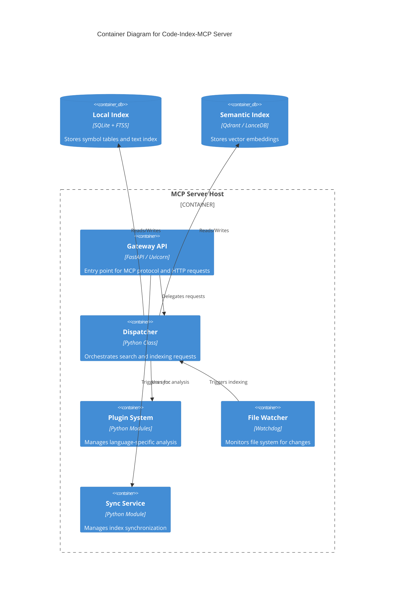
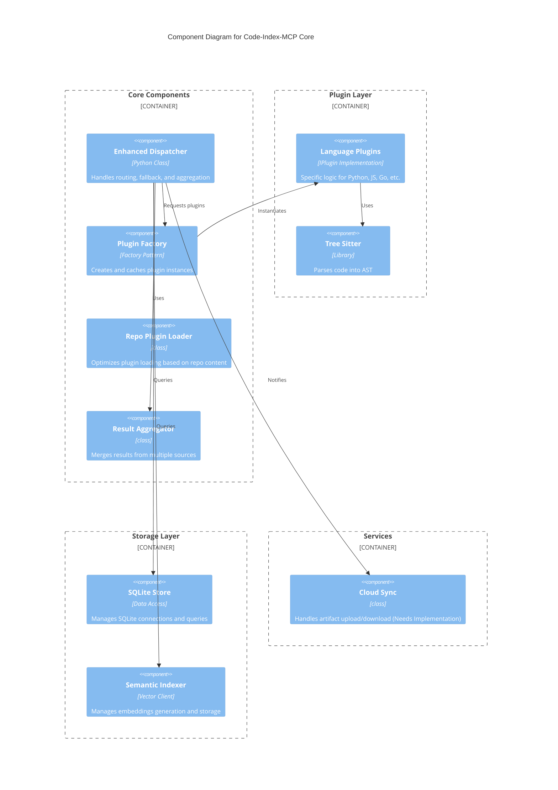

# System Architecture

## Level 1: System Context

```mermaid
C4Context
    title System Context Diagram for Code-Index-MCP

    Person(developer, "Developer", "Uses the system to index and search code")
    System(code_index_mcp, "Code-Index-MCP", "Local-first code indexer providing MCP interface to LLMs")
    
    System_Ext(claude, "Claude / LLM", "AI Assistant consuming the MCP tools")
    System_Ext(git, "Git Repository", "Source code to be indexed")
    System_Ext(github, "GitHub Artifacts", "Storage for shared indexes")

    Rel(developer, claude, "Prompts", "Text")
    Rel(claude, code_index_mcp, "Calls Tools", "MCP Protocol")
    Rel(code_index_mcp, git, "Watches & Indexes", "File System Events")
    Rel(code_index_mcp, github, "Syncs Indexes", "HTTPS")
```

## Level 2: Container Diagram

```mermaid
C4Container
    title Container Diagram for Code-Index-MCP Server

    Container_Boundary(mcp_server_boundary, "MCP Server Host") {
        Container(gateway, "Gateway API", "FastAPI / Uvicorn", "Entry point for MCP protocol and HTTP requests")
        Container(dispatcher, "Dispatcher", "Python Class", "Orchestrates search and indexing requests")
        Container(plugin_system, "Plugin System", "Python Modules", "Manages language-specific analysis")
        Container(file_watcher, "File Watcher", "Watchdog", "Monitors file system for changes")
        Container(sync_service, "Sync Service", "Python Module", "Manages index synchronization")
    }

    ContainerDb(sqlite, "Local Index", "SQLite + FTS5", "Stores symbol tables and text index")
    ContainerDb(vector_db, "Semantic Index", "Qdrant / LanceDB", "Stores vector embeddings")

    Rel(gateway, dispatcher, "Delegates requests")
    Rel(dispatcher, plugin_system, "Uses for analysis")
    Rel(dispatcher, sqlite, "Reads/Writes")
    Rel(dispatcher, vector_db, "Reads/Writes")
    Rel(file_watcher, dispatcher, "Triggers indexing")
    Rel(gateway, sync_service, "Triggers sync")
```

## Level 3: Component Diagram (MCP Server)

```mermaid
C4Component
    title Component Diagram for Code-Index-MCP Core

    Container_Boundary(core, "Core Components") {
        Component(enhanced_dispatcher, "Enhanced Dispatcher", "Python Class", "Handles routing, fallback, and aggregation")
        Component(plugin_factory, "Plugin Factory", "Factory Pattern", "Creates and caches plugin instances")
        Component(repo_plugin_loader, "Repo Plugin Loader", "class", "Optimizes plugin loading based on repo content")
        Component(result_aggregator, "Result Aggregator", "class", "Merges results from multiple sources")
    }

    Container_Boundary(plugins, "Plugin Layer") {
        Component(language_plugins, "Language Plugins", "IPlugin Implementation", "Specific logic for Python, JS, Go, etc.")
        Component(parser, "Tree Sitter", "Library", "Parses code into AST")
    }

    Container_Boundary(storage, "Storage Layer") {
        Component(sqlite_store, "SQLite Store", "Data Access", "Manages SQLite connections and queries")
        Component(semantic_indexer, "Semantic Indexer", "Vector Client", "Manages embeddings generation and storage")
    }
    
    Container_Boundary(services, "Services") {
        Component(cloud_sync, "Cloud Sync", "class", "Handles artifact upload/download (Needs Implementation)")
    }

    Rel(enhanced_dispatcher, plugin_factory, "Requests plugins")
    Rel(plugin_factory, language_plugins, "Instantiates")
    Rel(language_plugins, parser, "Uses")
    Rel(enhanced_dispatcher, result_aggregator, "Uses")
    Rel(enhanced_dispatcher, sqlite_store, "Queries")
    Rel(enhanced_dispatcher, semantic_indexer, "Queries")
    Rel(enhanced_dispatcher, cloud_sync, "Notifies")
```
